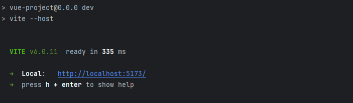
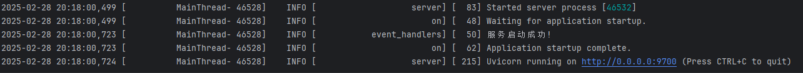
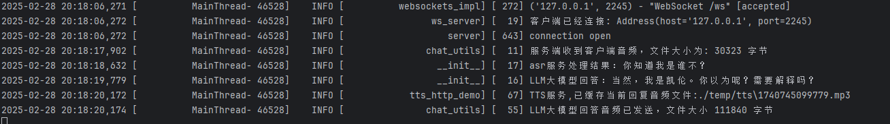
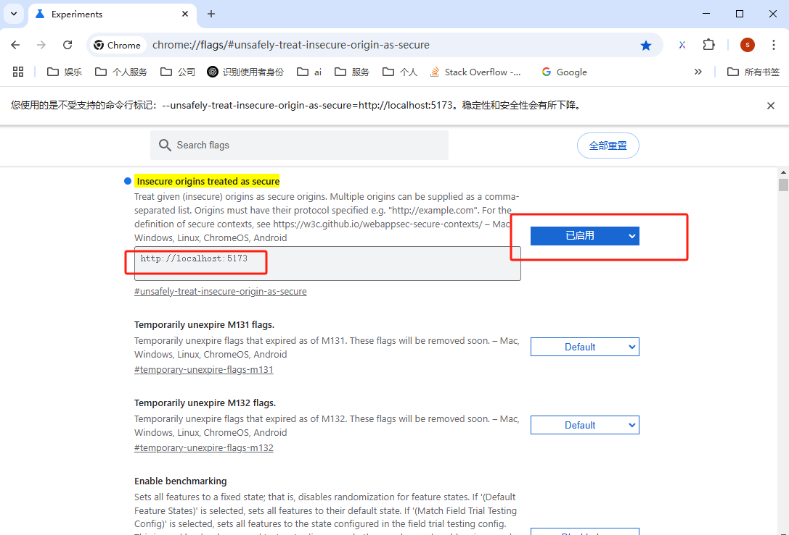
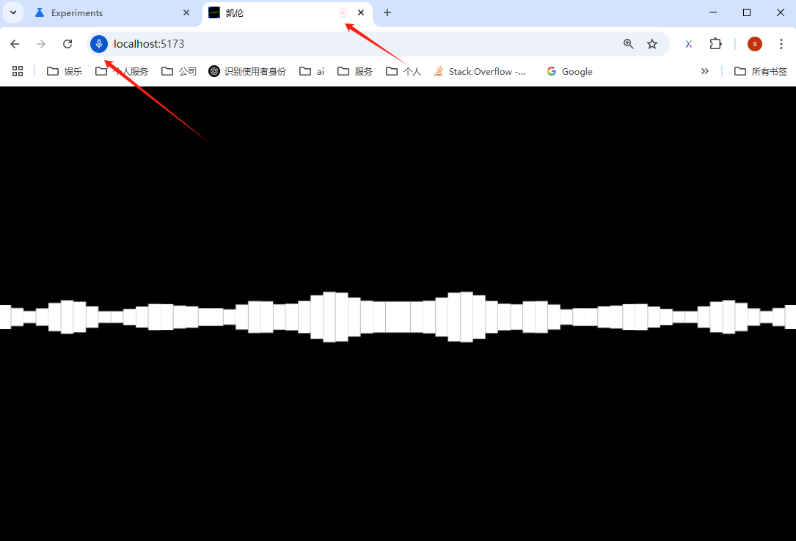

# 安装文档

## 前端项目

推荐使用nodeV20.11.0+版本进行安装

### npm安装

```
npm install
```

### 项目运行

```
npm run dev
```

运行成功如下所示




## 后端项目

推荐使用python 3.11版本

### 普通安装

```
pip install -r requirements.txt
```


### conde安装

```
conda create --name bikini_bottom_karen_server python=3.11
```

```
conda activate base bikini_bottom_karen_server
```

如果安装错误可以删除后重新安装

```
conda remove -n bikini_bottom_karen_server --all
```


### 运行

```
python .\application.py
```

运行成功如下所示




业务处理日志如下




## 谷歌浏览器配置不安全的来源

推荐使用谷歌浏览器，并打开此网站的音视频设置。

或者使用https协议运行，则不需要格外配置

```
chrome://flags/#unsafely-treat-insecure-origin-as-secure
```

```
http://localhost:5173
```



配置成功如下效果



## 配置在线服务

修改配置文件**.env**，对接在线服务

### 智谱清言LLM服务

```
# 智谱ai
ZHIPU.TOKEN=xxxx
ZHIPU.MODEL=GLM-4-Flash
```

### 百度ASR服务

```
# 百度stt服务
BAIDU.STT.APP_ID=xxx
BAIDU.STT.ACCESS_TOKEN=xxx
BAIDU.STT.SECRET_KEY=xxx
```

### 火山引擎TTS服务

```
# 火山引擎tts服务
TTS.APPID=xxxx
TTS.ACCESS_TOKEN=xxxx
TTS.CLUSTER=xxxx
TTS.VOICE_TYPE="BV001_streaming"
TTS.HOST="openspeech.bytedance.com"
```

