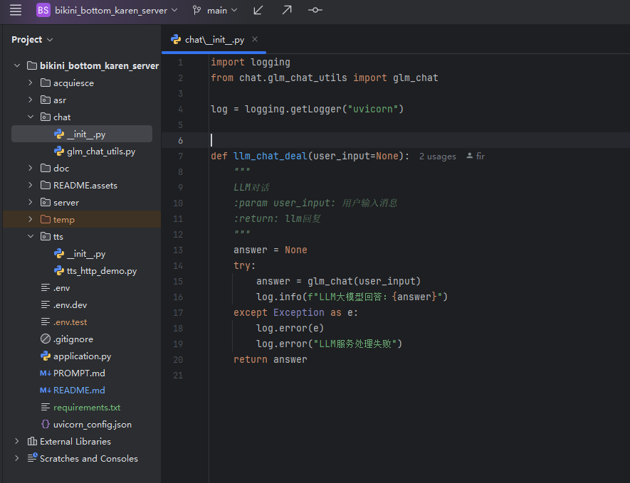
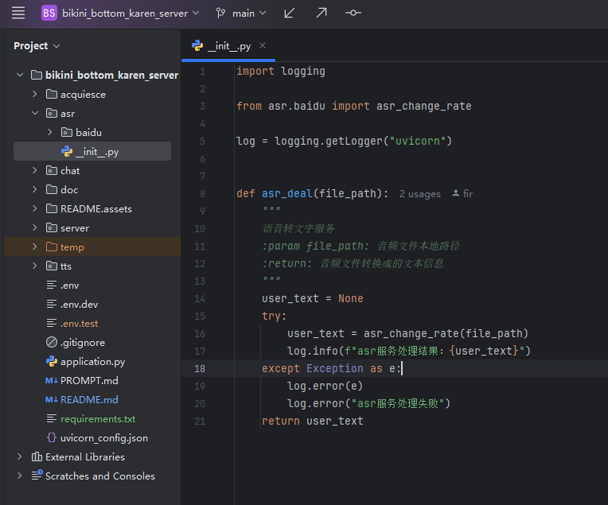
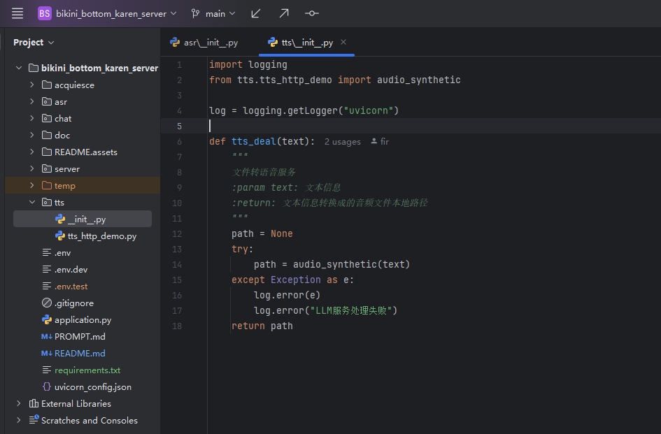

## 修改端口

修改application.py中如下内容

```python
        uvicorn.run(ws_server_run(), host="0.0.0.0", port=9700, log_config="uvicorn_config.json",
                    use_colors=True,
                    loop="asyncio",
                    )
```

## WS连接逻辑

```python
                # 接收二进制消息
                message = await websocket.receive_bytes()
                # 处理前端音频，得到音频回复
                num = len(self.clients)
                audio_data = await chatchat(message, num)
                # 发送结果
                await websocket.send_bytes(audio_data)
```

## LLM服务修改

修改以下犯法，实现对接其他LLM服务



## ASR服务

推荐使用**fast whisper**可以实现本地服务

修改以下方法，实现对接其他服务



## TTS服务修改

